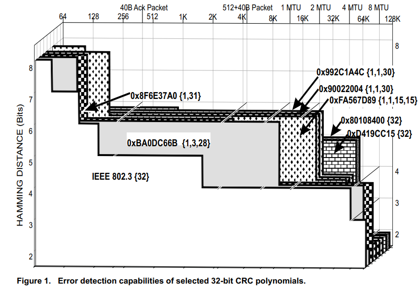

# 利用CRC校验实现对象存储可靠性检查
## hamming_count.py

用汉明距离的大小，衡量此错误发生的概率。

统计不同错码位数下，CRC校验码的汉明距离

### 注意:   仅作原理展示，不适用于长数据的统计，实际计算必须 C++ 优化重写代码。

结果可见 论文 [32-Bit Cyclic Redundancy Codes for Internet Applications](./docs/32-Bit-Cyclic-Redundancy-Codes-for-Internet-Applications.pdf)


 

统计 n 长度数据包，r 长度校验码，k 个错误下的汉明距离分布，复杂度约为 (n-r)^k，增长速度为阶乘级别。

### 本脚本用于测量：
    存储出错，在CRC值中反应不出来的概率
    1.a crc码无误，数据碰撞
        根据循环性质，概率 2^(-n)

    1.c crc错误，掩盖数据错误
        数据与CRC的RAM内存单元实际都可能异常。 (涵盖1.a 1.b)
        错码 与 错码的CRC(数bit再错) 实现hash对应。

    概率测量方式：给定原码 m ，根据错误bit概率，考察对应汉明距离的各码 a,b,c...。
                各自的校验码有 Cm, Ca，Cb，Cc ...。
                计算Cm与Ca,Cb，Cc...的汉明距离，即错误被错误掩盖的概率。


### 校验原理
任意随机原码，给定错误比特数，误码的CRC值与原码CRC值的汉明距离分布相同。

故：只需一次测试，即test_time = 1足矣。
```py
# 参数
data_len = 4
crc_len = 4
error_bits = 3
test_time = 10
crc_algorithm = 'crc-32'
# 测试输出 test no.1 ~ no.10
Hamming Distance List:
[0, 0, 0, 0, 0, 0, 4, 2, 25, 21, 103, 114, 225, 437, 554, 690, 735, 686, 470, 404, 242, 105, 85, 37, 11, 10, 0, 0, 0, 0, 0, 0, 0]
[0, 0, 0, 0, 0, 0, 8, 4, 50, 42, 206, 228, 450, 874, 1108, 1380, 1470, 1372, 940, 808, 484, 210, 170, 74, 22, 20, 0, 0, 0, 0, 0, 0, 0]
[0, 0, 0, 0, 0, 0, 12, 6, 75, 63, 309, 342, 675, 1311, 1662, 2070, 2205, 2058, 1410, 1212, 726, 315, 255, 111, 33, 30, 0, 0, 0, 0, 0, 0, 0]
[0, 0, 0, 0, 0, 0, 16, 8, 100, 84, 412, 456, 900, 1748, 2216, 2760, 2940, 2744, 1880, 1616, 968, 420, 340, 148, 44, 40, 0, 0, 0, 0, 0, 0, 0]
[0, 0, 0, 0, 0, 0, 20, 10, 125, 105, 515, 570, 1125, 2185, 2770, 3450, 3675, 3430, 2350, 2020, 1210, 525, 425, 185, 55, 50, 0, 0, 0, 0, 0, 0, 0]
[0, 0, 0, 0, 0, 0, 24, 12, 150, 126, 618, 684, 1350, 2622, 3324, 4140, 4410, 4116, 2820, 2424, 1452, 630, 510, 222, 66, 60, 0, 0, 0, 0, 0, 0, 0]
[0, 0, 0, 0, 0, 0, 28, 14, 175, 147, 721, 798, 1575, 3059, 3878, 4830, 5145, 4802, 3290, 2828, 1694, 735, 595, 259, 77, 70, 0, 0, 0, 0, 0, 0, 0]
[0, 0, 0, 0, 0, 0, 32, 16, 200, 168, 824, 912, 1800, 3496, 4432, 5520, 5880, 5488, 3760, 3232, 1936, 840, 680, 296, 88, 80, 0, 0, 0, 0, 0, 0, 0]
[0, 0, 0, 0, 0, 0, 36, 18, 225, 189, 927, 1026, 2025, 3933, 4986, 6210, 6615, 6174, 4230, 3636, 2178, 945, 765, 333, 99, 90, 0, 0, 0, 0, 0, 0, 0]
[0, 0, 0, 0, 0, 0, 40, 20, 250, 210, 1030, 1140, 2250, 4370, 5540, 6900, 7350, 6860, 4700, 4040, 2420, 1050, 850, 370, 110, 100, 0, 0, 0, 0, 0, 0, 0]
```

# 运行示例
设算法为CRC32，数据位宽为32bit，错误比特从1~7，测试次数为10次。

错误 bit 增加，crc校验码的汉明距离减小，即错误被错误掩盖的概率增大。
```py
# 参数
data_len = 4
crc_len = 4
error_bits = 7
test_time = 10
crc_algorithm = 'crc-32'
# 输出
Error Bits: 1
Minimum Hamming Distance : 12
[0, 0, 0, 0, 0, 0, 0, 0, 0, 0, 0, 0, 70, 60, 40, 10, 10, 70, 40, 0, 20, 0, 0, 0, 0, 0, 0, 0, 0, 0, 0, 0, 0]
Error Bits: 2
Minimum Hamming Distance : 8
[0, 0, 0, 0, 0, 0, 0, 0, 20, 30, 250, 70, 100, 470, 440, 980, 790, 620, 510, 210, 250, 90, 50, 40, 30, 10, 0, 0, 0, 0, 0, 0, 0]
Error Bits: 3
Minimum Hamming Distance : 6
[0, 0, 0, 0, 0, 0, 40, 20, 250, 210, 1030, 1140, 2250, 4370, 5540, 6900, 7350, 6860, 4700, 4040, 2420, 1050, 850, 370, 110, 100, 0, 0, 0, 0, 0, 0, 0]
Error Bits: 4
Minimum Hamming Distance : 6
[0, 0, 0, 0, 0, 0, 300, 320, 1060, 1660, 5620, 10440, 18960, 29210, 40030, 47840, 49070, 47560, 38530, 28690, 20130, 11020, 5050, 2680, 1010, 330, 80, 10, 0, 0, 0, 0, 0]
Error Bits: 5
Minimum Hamming Distance : 5
[0, 0, 0, 0, 0, 140, 420, 1660, 5690, 10980, 28610, 61220, 106000, 163070, 222930, 263620, 280110, 264260, 222890, 165020, 105580, 60830, 30990, 13090, 4880, 1260, 300, 180, 20, 10, 0, 0, 0]
Error Bits: 6
Minimum Hamming Distance : 4
[0, 0, 0, 0, 30, 310, 1780, 7580, 22480, 59630, 136150, 269980, 476320, 735550, 988710, 1185060, 1269660, 1200070, 1003650, 732210, 474960, 271410, 134630, 60770, 21580, 7140, 1790, 400, 60, 10, 0, 0, 0]
Error Bits: 7
Minimum Hamming Distance : 3
[0, 0, 0, 30, 170, 1490, 6560, 27100, 81670, 220350, 504960, 1009920, 1774150, 2726460, 3686920, 4438800, 4703640, 4429050, 3708590, 2724900, 1761490, 1006840, 505530, 220520, 82400, 27610, 7410, 1660, 320, 10, 10, 0, 0]